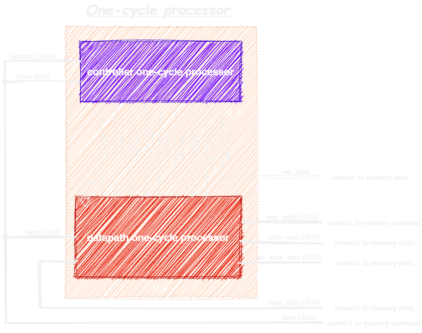
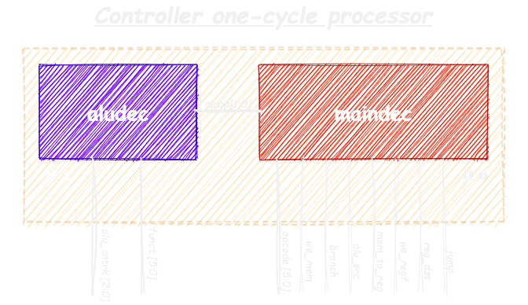

# One-cycle processor on architecture MIPS

## Supported instructions:
| type instruction | Mnemonics               | 
|:----------------:|:------------------------|
| R-type           | add, sub, and, or, slt; |
| I-type           | addi, lw, sw;           |
| J-type           | j, beq;                 |

## 1.0 Top-level module

This is the top processor module. For operation, command memory (with a loaded program) and data memory are connected to this module. The picture 1.1 shows which signals are connected to the command memory and which to the data memory.The memory modules are located in the source code folder of the processor.

<figure>
  
  <figcaption align="center" font-style="italic"> Picture 1.1 - One-cycle processor MIPS </figcaption>
</figure>

The table 1.1 shows the modules included in the upper processor module and their description.

### *Table 1.1 - top-level modules* 
| Number   | Name instance   | Name module   | Description module             |
|:--------:|:---------------:|:-------------:|:-------------------------------|
|0         | U_0             | controller    | controller one-cycle processor |
|1         | U_1             | datapath      | data path  one-cycle processor |

## 2.0 Data path module

This is a data path module. The program instruction enters it and is then executed.

<figure>
  
  <figcaption align="center" font-style="italic"> Picture 2.1 - One-cycle data path module processor MIPS </figcaption>
</figure>

The table 2.1 shows the modules included in the processor data path and their description

### *Table 2.1 - data path modules* 
| Number   | Name instance   | Name module   | Description module                                      |
|:--------:|:---------------:|:-------------:|:--------------------------------------------------------|
|0         | U_0             | pc            | program counter 32-bit                                  |
|1         | U_1             | adder         | adder of the following instruction                      |
|2         | U_2             | adder         | adder of the following branch instruction               |
|3         | U_3             | slt2          | shift logic left address constant in J-type instruction |
|4         | U_4             | mux2          | J-type instruction or branch/next instruction           |
|5         | U_5             | mux2          | branch or next instruction                              |
|6         | U_6             | mux2          | source register for I-type or R-type instruction        |
|7         | U_7             | regfile       | register file, width 32 and 32 registers                |
|8         | U_8             | exsign        | signing extended for 16-bit number to 32-bit            |
|9         | U_9             | slt2          | extension of the address instruction                    |
|10        | U_10            | mux2          | source B argument ALU: Imm-constant or RD2 from regfile |
|11        | U_11            | alu           | arifmetic-logic unit                                    |
|12        | U_12            | mux2          | in regfile write: data from memory or result ALU        |

## 3.0 Controller module

This is a processor controller module. Depending on the incoming instruction, it generates flags that control the data path.

<figure>
  
  <figcaption align="center" font-style="italic"> Picture 3.1 - One-cycle controller module processor MIPS </figcaption>
</figure>

The table 3.1 shows the modules included in the processor controller and their description

### *Table 3.1 - comtroller modules* 
| Number   | Name instance   | Name module   | Description module                           |
|:--------:|:---------------:|:-------------:|:---------------------------------------------|
|0         | U_0             | maindec       | decoder for controlling flags from data path |
|1         | U_1             | aludec        | decoder for alu                              |